# 📦 Automated Price Tracker

An intelligent **Amazon Price Tracker** built with **Flask**, **Playwright**, **SQLite**, and **APScheduler** that automatically monitors product prices and sends email alerts whenever the price drops below your target price.

---

# 📖 Project Description

Online shoppers often miss discounts because checking product prices manually is time-consuming.

This project allows users to:

- Track multiple Amazon products
- Automatically scrape product prices
- Store price history
- Visualize price changes
- Export price history
- Receive automatic email notifications whenever a product reaches the desired target price

---

# ✨ Features

✅ User Registration & Login

✅ Secure Password Authentication

✅ Add Amazon Products

✅ Automatic Product Information Extraction

- Product Title
- Current Price
- Product Image

✅ Automatic Price Tracking

- APScheduler checks prices periodically

✅ Price History Storage

✅ Interactive Price History Chart

✅ Product Statistics

- Current Price
- Lowest Price
- Highest Price
- Average Price

✅ Email Notifications

- Automatic Gmail alerts

✅ Export Price History to CSV

✅ Dashboard with Product Cards

✅ Alerts Log

✅ Secure Environment Variables using .env

---

# 🛠 Tech Stack

### Backend

- Python
- Flask

### Database

- SQLite
- Flask SQLAlchemy

### Web Scraping

- Playwright

### Scheduler

- APScheduler

### Frontend

- HTML
- CSS
- JavaScript
- Bootstrap

### Charts

- Chart.js

### Email

- Gmail SMTP

---

# 📸 Screenshots

## 1️⃣ User Registration

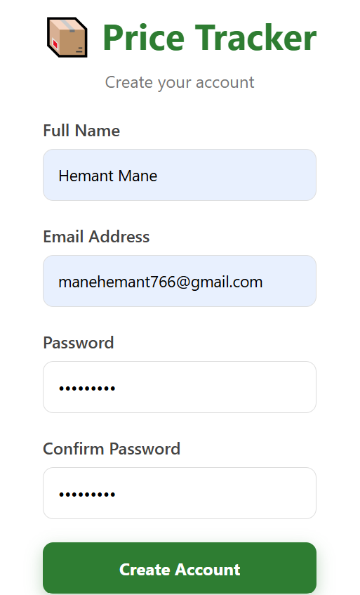

---

## 2️⃣ User Login

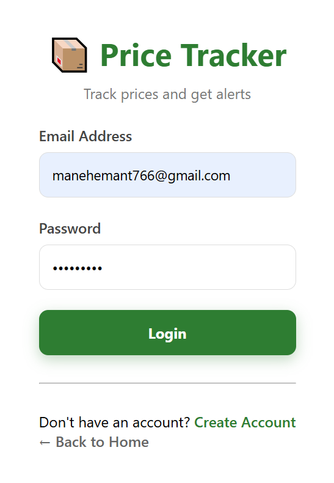

---

## 3️⃣ Dashboard

The dashboard displays all tracked products along with statistics.

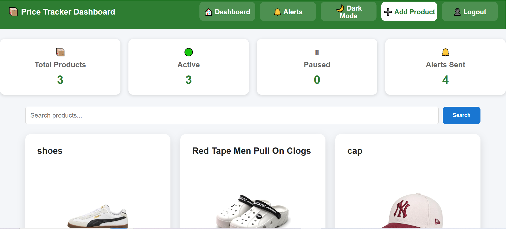

---

## 4️⃣ Add Product

Users can add any Amazon product URL and set a target price.

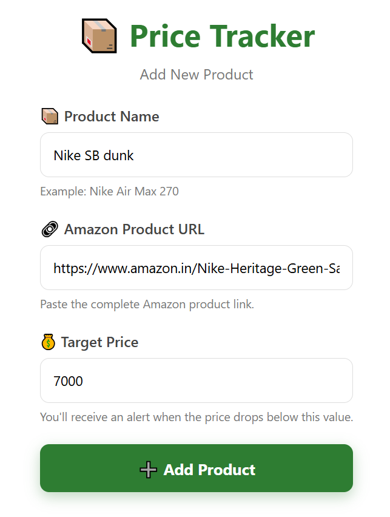

---

## 5️⃣ Product Details

Displays

- Product Image
- Current Price
- Product Information

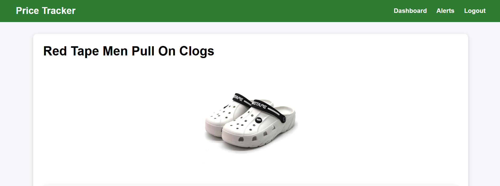

---

## 6️⃣ Product Statistics

Shows

- Current Price
- Lowest Price
- Highest Price
- Average Price

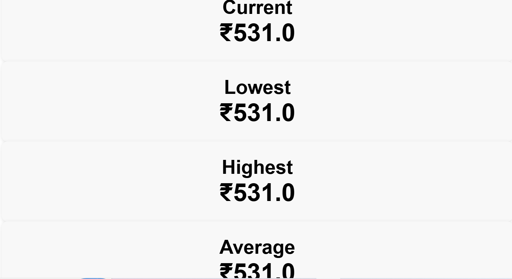

---

## 7️⃣ Price History Table

Every price change is recorded automatically.

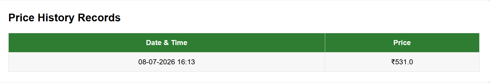

---

## 8️⃣ Price History Chart

Visual representation of price changes.

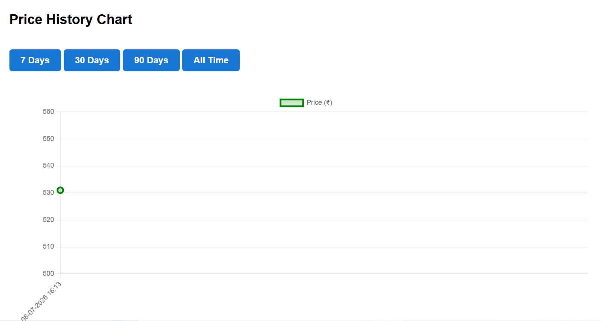

---

## 9️⃣ Email Price Alert

Whenever the target price is reached, an email is sent automatically.

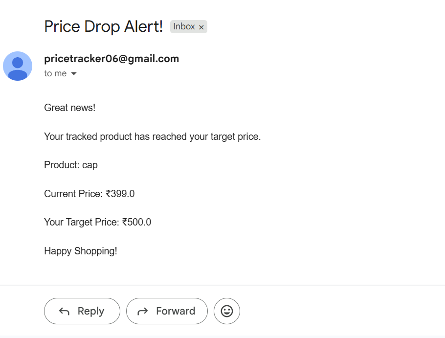

---

## 🔟 Export Price History

Users can export price history as a CSV file.

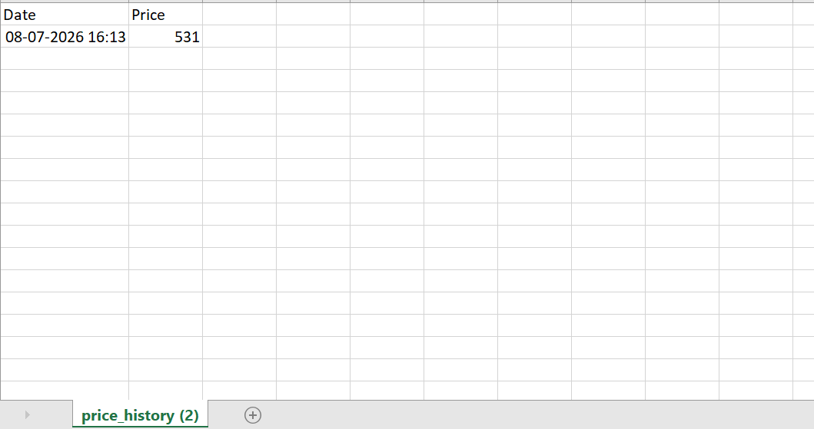

---

## 1️⃣1️⃣ Database

SQLite Database Tables

- User
- Tracked Product
- Price History
- Alert Sent

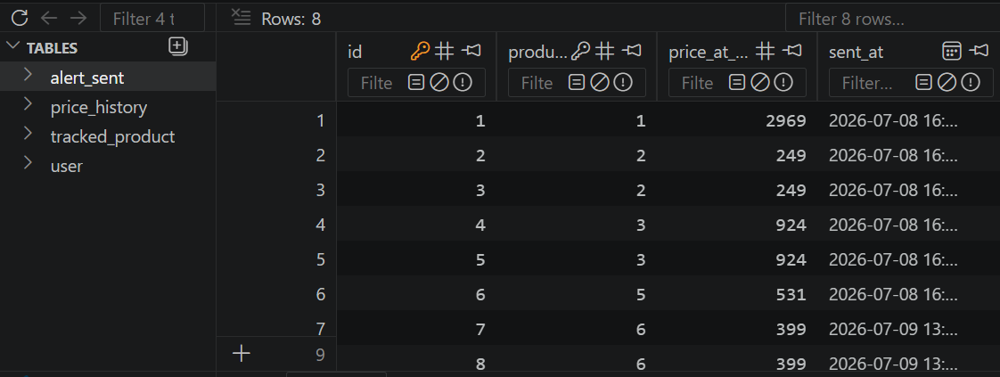

---

## 1️⃣2️⃣ Project Folder Structure

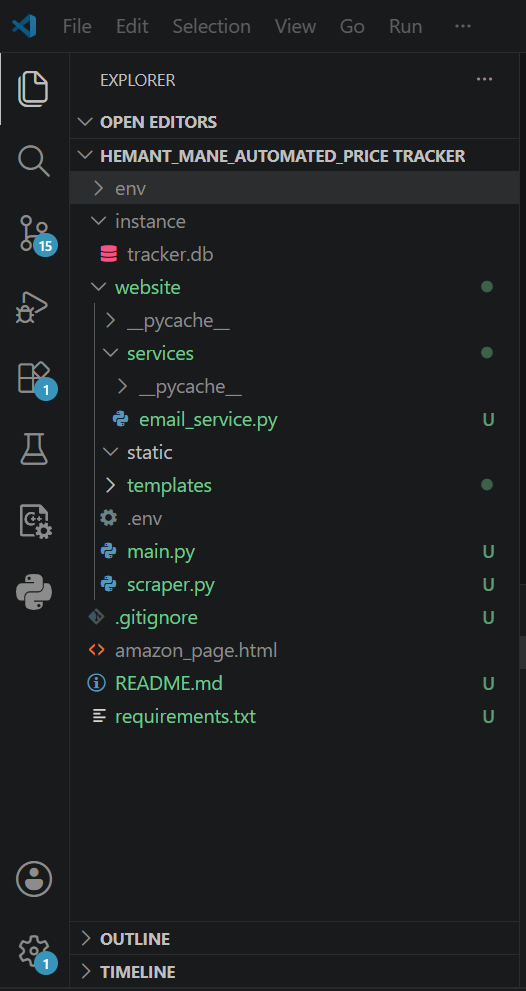

---

# ⚙ Installation

Clone the repository

```bash
git clone https://github.com/yourusername/price-tracker.git
```

Move into the project

```bash
cd price-tracker
```

Create Virtual Environment

```bash
python -m venv env
```

Activate

Windows

```bash
env\Scripts\activate
```

Install dependencies

```bash
pip install -r requirements.txt
```

Create a `.env` file

```env
SENDER_EMAIL=your_email@gmail.com
APP_PASSWORD=your_gmail_app_password
```

Run the project

```bash
python main.py
```

Open

```
http://127.0.0.1:5000
```

---

# 📂 Project Structure

```
Price Tracker
│
├── website
│   ├── static
│   ├── templates
│   ├── services
│   │     └── email_service.py
│   │
│   └── scraper.py
│
├── instance
│     └── tracker.db
│
├── main.py
├── requirements.txt
├── README.md
└── .env
```

---

# 🚀 Future Improvements

- Flipkart Support
- Amazon International Support
- Telegram Notifications
- WhatsApp Notifications
- Mobile Responsive Dashboard
- Docker Deployment
- PostgreSQL Support
- Celery + Redis Background Jobs
- Price Prediction using Machine Learning
- Browser Extension

---

# 👨‍💻 Author

**Hemant Mane**

Python Developer | Flask Developer

GitHub: https://github.com/hem-works

LinkedIn: https://www.linkedin.com/in/hemantmane766

---

# ⭐ If you found this project useful

Please consider giving it a ⭐ on GitHub.